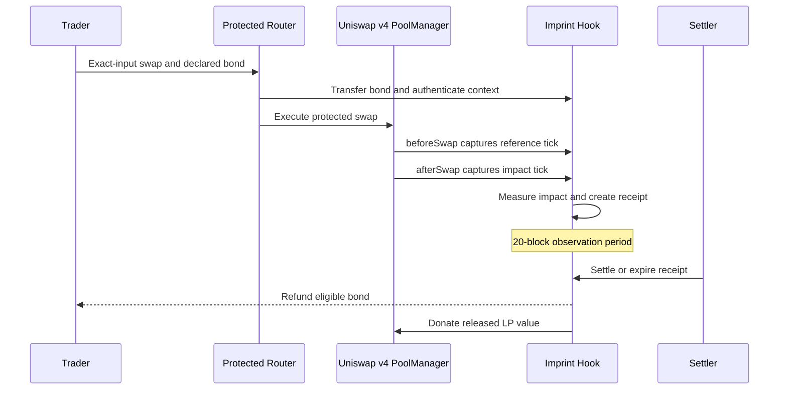

<h1>
  
  Imprint
</h1>

**A Uniswap v4 hook for refundable price-impact bonds.**

Imprint is a Uniswap v4 hook that makes large-swap price impact measurable and accountable.

The hook observes the pool tick before and after each protected swap, calculates a required bond from the measured displacement and creates an onchain receipt. It then observes whether the price movement persists.

Persistent movement earns the trader a refund. Reversed movement compensates the liquidity providers that absorbed the temporary pressure.

<p>
  <a href="https://imprint-hq.netlify.app/"><strong>Live application</strong></a>
  ·
  <a href="https://unichain-sepolia.blockscout.com/address/0x58e9eb947696c4ea9a80e65e901162e9be3e00c0"><strong>Verified hook</strong></a>
  ·
  <a href="https://unichain-sepolia.blockscout.com/address/0xa00b6237abe4606f9b20b57b67a82b5591f0667c"><strong>Verified router</strong></a>
</p>


## Why Imprint

Large swaps can move a pool’s price significantly. The market may confirm that movement, or the price may reverse after liquidity providers have absorbed the temporary pressure.

Standard swap execution records the trade but does not distinguish between persistent price discovery and temporary displacement.

Imprint adds that missing accountability layer:

- Measures the pool tick before and after a protected swap.
- Calculates a required bond from the measured displacement.
- Observes whether the price movement persists.
- Refunds the persistent share of the bond to the trader.
- Queues the reversed share for gradual donation to LPs.
- Aggregates directional pressure across traders to resist split-swap bypasses.
- Stores the result in a recoverable onchain receipt.

## The Uniswap v4 hook

`ImprintHook` integrates directly with the Uniswap v4 `PoolManager` through the `beforeSwap` and `afterSwap` hook callbacks.

The hook uses these callbacks to:

- Capture the reference tick before a protected swap.
- Capture the impact tick after execution.
- Measure the resulting directional displacement.
- Accumulate pool-wide directional movement across traders.
- Calculate the required input-token bond.
- Create and store an onchain bond receipt.
- Resolve the receipt after the observation period.
- Queue reversed bond value for gradual donation to LPs.

The hook declares only the `beforeSwap` and `afterSwap` Uniswap v4 permissions.

It only accepts protected swaps authenticated by `ImprintProtectedRouter`. This preserves the original trader, bond token, declared bond and nonce while the swap executes through the v4 `PoolManager`.

Imprint does not replace the pool or modify Uniswap v4’s core accounting. It adds an accountability layer through standard hook callbacks and the PoolManager’s native donation mechanism.

## How it works



### 1. Protect

The trader calls `protectedSwapExactInput` through `ImprintProtectedRouter`.

The router:

- Accepts exact-input swaps.
- Preserves the original trader identity.
- Collects the declared bond in the input token.
- Encodes authenticated hook data.
- Executes the swap through the Uniswap v4 `PoolManager`.
- Enforces the minimum output.
- Enforces the deadline block.
- Rejects pools without a hook.
- Rejects native-currency input.
- Rejects fee-on-transfer bond mismatches.

### 2. Measure

The hook records:

- The pool ID.
- The original trader.
- The bond token.
- The reference tick before the swap.
- The impact tick after the swap.
- The measured tick displacement.
- The declared bond.
- The calculated required bond.
- The settlement block.
- The expiry block.
- The receipt status.

Only swaps executed through the trusted protected router can create Imprint receipts.

### 3. Observe

Each receipt waits through a 20-block observation period.

Imprint compares the later settlement tick with the original reference and impact ticks to determine how much of the measured price movement persisted.

### 4. Resolve

| Outcome | Resolution |
| --- | --- |
| Movement persists | The persistent share of the required bond is refunded to the trader. |
| Movement reverses | The reversed share is queued for gradual donation to LPs. |
| Receipt expires | The required bond is queued for LPs and any declared excess is refunded. |

Settlement and expiry are permissionless.

A third party may finalize a receipt, but any trader refund is always sent to the original trader recorded in that receipt.

A receipt cannot be finalized more than once.

## Bond curve

Imprint calculates the required bond from the input-token notional and measured tick displacement.

| Parameter | Value |
| --- | ---: |
| Impact threshold | 50 ticks |
| Base bond rate | 100 bps / 1% |
| Slope above threshold | 10 bps per tick |
| Maximum bond rate | 2,000 bps / 20% |
| Observation period | 20 blocks |
| Settlement window | 100 blocks |
| Directional accumulation window | 5 blocks |
| Donation cooldown | 5 blocks |
| Donation release slice | 1,000 bps / 10% |

Swaps at or below the 50-tick threshold do not require an impact bond.

Above the threshold, the required rate starts from the 1% base rate and increases by 10 basis points for every additional tick. The rate is capped at 20%.

The frontend declares the 20% safety ceiling before execution. The hook calculates the actual required bond from the measured impact.

Any amount declared above the required bond is returned during settlement or expiry.

## Persistence and settlement

The hook measures persistence by comparing three ticks:

- `referenceTick`: the tick before the protected swap.
- `impactTick`: the tick immediately after the protected swap.
- `settlementTick`: the tick when the receipt is settled.

The persistent share is bounded between 0% and 100%.

The settlement calculation conserves the required bond:

```text
trader refund + LP share = required bond
```

Any declared amount above the required bond is separately refunded to the trader.

## Split-swap resistance

Measuring each wallet independently would allow a large directional move to be divided across smaller swaps.

Imprint instead maintains a pool-global directional impact window:

- Directional movement is accumulated at pool level.
- Activity is combined across traders.
- The accumulation window lasts five blocks.
- Splitting a move across wallets does not reset the measurement.
- Splitting a move across transactions does not bypass the threshold.
- Stale or incompatible directional movement resets the relevant window.
- Bond requirements follow pool pressure rather than wallet count.

The test suite covers both same-trader and cross-trader split resistance.

## LP donation streaming

Reversed or expired bond value is not released to the pool all at once.

Imprint stores it in a donation reserve identified by:

- Pool ID.
- Bond token.

The reserve is released through `dripDonation`:

- Donations are permissionless.
- A five-block cooldown separates releases.
- Each release is 10% of the remaining configured reserve calculation.
- The donation is made through the Uniswap v4 `PoolManager`.
- The donation amount and remaining reserve are emitted onchain.

This gradual release reduces the risk of converting one resolved receipt into a single abrupt pool event.

## Architecture

```text
Trader
  |
  | protectedSwapExactInput(...)
  v
ImprintProtectedRouter
  |-- validates amount, hook, deadline and output constraints
  |-- collects the declared input-token bond
  |-- preserves the original trader identity
  |-- encodes authenticated hook data
  |
  v
Uniswap v4 PoolManager
  |-- executes the exact-input swap
  |-- calls beforeSwap and afterSwap
  |
  v
ImprintHook
  |-- authenticates the trusted router
  |-- measures pool tick displacement
  |-- maintains the pool-global impact window
  |-- creates the bond receipt
  |-- settles or expires the receipt
  |-- queues reversed value in the LP reserve
  |
  v
Uniswap v4 donation
```

## Core contracts

| Component | Responsibility |
| --- | --- |
| [`ImprintHook.sol`](./src/ImprintHook.sol) | Measures impact, maintains pool-global accumulation windows, creates receipts, resolves bonds and manages LP donation streams. |
| [`ImprintProtectedRouter.sol`](./src/router/ImprintProtectedRouter.sol) | Executes authenticated exact-input swaps and escrows declared bonds. |
| [`ImpactBondMath.sol`](./src/libraries/ImpactBondMath.sol) | Calculates tick distance, bond rates, persistence and settlement amounts. |
| [`ImprintHookData.sol`](./src/libraries/ImprintHookData.sol) | Encodes and validates the fixed-length protected-swap context passed to the hook. |
| [`DeployImprint.s.sol`](./script/DeployImprint.s.sol) | Deploys the protected router and mines a hook address with the required Uniswap v4 permission flags. |
| [`LaunchImprintPool.s.sol`](./script/LaunchImprintPool.s.sol) | Initializes the public USDC/WETH pool and adds its initial full-range liquidity position. |

## Hook events

The hook exposes events for tracking its full lifecycle:

| Event | Purpose |
| --- | --- |
| `ImpactWindowUpdated` | Records changes to the pool-global directional accumulation window. |
| `BondReceiptCreated` | Records the measured impact and newly created bond receipt. |
| `BondReceiptFinalized` | Records settlement or expiry and the resulting refund and LP allocation. |
| `DonationQueued` | Records bond value added to an LP donation reserve. |
| `DonationDripped` | Records value donated to the pool and the remaining reserve. |

The protected router emits `ProtectedSwap` for each successfully executed authenticated swap.

## Live deployment

Imprint is deployed on **Unichain Sepolia**, chain ID `1301`.

| Component | Address |
| --- | --- |
| PoolManager | [`0x00B036B58a818B1BC34d502D3fE730Db729e62AC`](https://unichain-sepolia.blockscout.com/address/0x00b036b58a818b1bc34d502d3fe730db729e62ac) |
| PositionManager | [`0xf969Aee60879C54bAAed9F3eD26147Db216Fd664`](https://unichain-sepolia.blockscout.com/address/0xf969aee60879c54baaed9f3ed26147db216fd664) |
| StateView | [`0xc199f1072a74d4e905aba1a84d9a45e2546b6222`](https://unichain-sepolia.blockscout.com/address/0xc199f1072a74d4e905aba1a84d9a45e2546b6222) |
| Permit2 | [`0x000000000022D473030F116dDEE9F6B43aC78BA3`](https://unichain-sepolia.blockscout.com/address/0x000000000022d473030f116ddee9f6b43ac78ba3) |
| Protected router | [`0xA00B6237abE4606F9b20b57B67A82B5591F0667c`](https://unichain-sepolia.blockscout.com/address/0xa00b6237abe4606f9b20b57b67a82b5591f0667c) |
| Imprint hook | [`0x58e9eB947696c4EA9A80E65e901162E9BE3E00C0`](https://unichain-sepolia.blockscout.com/address/0x58e9eb947696c4ea9a80e65e901162e9be3e00c0) |
| USDC | [`0x31d0220469e10c4E71834a79b1f276d740d3768F`](https://unichain-sepolia.blockscout.com/address/0x31d0220469e10c4e71834a79b1f276d740d3768f) |
| WETH | [`0x4200000000000000000000000000000000000006`](https://unichain-sepolia.blockscout.com/address/0x4200000000000000000000000000000000000006) |

The complete machine-readable deployment record is available in [`deployments/unichain-sepolia.json`](./deployments/unichain-sepolia.json).

## Public Imprint pool

| Property | Value |
| --- | --- |
| Network | Unichain Sepolia |
| Chain ID | `1301` |
| Pair | USDC / WETH |
| Pool ID | `0xd5519a432b0a3bbb56ddf4b80b11488a7c49966138cad8618bed527d74af9a76` |
| LP fee | 3,000 / 0.30% |
| Tick spacing | 60 |
| Initial tick | 193,379 |
| Initial `sqrtPriceX96` | `1252707241875239655932069007848031` |
| Position NFT | `#7867` |
| Initial liquidity | `189736659610` |
| Initial USDC | 12 USDC |
| Initial WETH | `0.002999999999998376` WETH |

## Verified live lifecycle

The deployed hook, router and pool have completed the full protected-swap, receipt, expiry and LP-donation lifecycle onchain.

| Measurement | Recorded value |
| --- | ---: |
| Receipt ID | `0x3c2b381036ed8bd07296afdc3485b64db9603338b62d0fbcb3dcfbfff7f7af55` |
| Exact input | 0.1 USDC |
| Output | 0.000024719621147631 WETH |
| Reference tick | 193,379 |
| Impact tick | 193,213 |
| Measured displacement | 166 ticks |
| Declared bond | 0.02 USDC |
| Required bond | 0.0126 USDC |
| Excess refund | 0.0074 USDC |
| Final status | Expired |
| First LP donation | 0.00126 USDC |
| Remaining donation reserve | 0.01134 USDC |

At 166 measured ticks, the configured curve produces a 12.6% required bond rate:

```text
0.1 USDC × 12.6% = 0.0126 USDC
```

The trader declared the 20% ceiling:

```text
0.1 USDC × 20% = 0.02 USDC
```

After expiry, the 0.0126 USDC required bond was queued for LPs and the 0.0074 USDC excess was refunded.

The first donation released 10% of the reserve:

```text
0.0126 USDC × 10% = 0.00126 USDC
```

This left 0.01134 USDC in the donation reserve.

## Lifecycle transactions

| Action | Transaction |
| --- | --- |
| Hook deployment | [`0x3704f7…a37a9a`](https://unichain-sepolia.blockscout.com/tx/0x3704f7e33a125667e0f84626c9f4f7bc67b85c95bfd65dc4dcc130dc79a37a9a) |
| Router deployment | [`0x14c337…d3c81`](https://unichain-sepolia.blockscout.com/tx/0x14c337f4dbcd233f7c327d19c7f1a1b31c9b8893d403ac8c2dc055071ccd3c81) |
| Pool launch | [`0x34b676…f8720`](https://unichain-sepolia.blockscout.com/tx/0x34b6761d0327f49c769619404717ccd7c2e48486714dbb3a9e3239d6764f8720) |
| Protected swap | [`0x1d8933…223ad`](https://unichain-sepolia.blockscout.com/tx/0x1d89337f8e0371bb77cde25dee0725ba79e12fc1df97a12657c90c81bca223ad) |
| Receipt expiry | [`0x9c9765…9547e`](https://unichain-sepolia.blockscout.com/tx/0x9c97659ce1403a8563988977daf4d0aff7b4f6698246a356d20a4db0b1e9547e) |
| First LP donation | [`0xe379fb…145d`](https://unichain-sepolia.blockscout.com/tx/0xe379fb3fa7712d45f9020dfff85248587b9c93cd56c915685ed13f11fb2a145d) |

## Live application

The public application is available at:

**[imprint-hq.netlify.app](https://imprint-hq.netlify.app/)**

The frontend supports:

- RainbowKit wallet connection.
- WalletConnect through a public Reown project ID.
- Unichain Sepolia network switching.
- Exact-input USDC to WETH protected swaps.
- Limited USDC authorization.
- Live USDC and WETH balances.
- Live pool tick and fee reads.
- Live impact-threshold and observation-window reads.
- Live LP donation-reserve reads.
- Onchain receipt recovery after a page refresh.
- Permissionless receipt settlement.
- Permissionless receipt expiry.
- Blockscout transaction links.

The frontend contract addresses and pool configuration are maintained in [`frontend/src/config.ts`](./frontend/src/config.ts).

## Getting started

### Requirements

Install:

- [Foundry](https://book.getfoundry.sh/getting-started/installation)
- [Node.js](https://nodejs.org/)
- npm
- Git

### Clone the repository

```bash
git clone https://github.com/Fatumayattani/imprint.git
cd imprint
git submodule update --init --recursive
```

### Build the contracts

```bash
forge build
```

### Run the Solidity tests

```bash
forge test -vv
```

The test suite covers:

- Deployment validation.
- Hook address permission flags.
- Hook-data encoding and validation.
- Tick-distance calculations.
- Bond-rate calculations.
- Settlement conservation.
- Persistence calculations.
- Trusted-router authentication.
- Unexpected bond-token rejection.
- Exact-input swap execution.
- Zero-bond swaps below the threshold.
- Minimum-output protection.
- Deadline enforcement.
- Native-input rejection.
- Fee-on-transfer token rejection.
- Receipt creation.
- Receipt settlement.
- Receipt expiry.
- Double-finalization prevention.
- Third-party settlement.
- Pool-global split resistance.
- Cross-trader split resistance.
- Impact-window resets.
- LP donation cooldown slices.

### Format and validate

```bash
forge fmt --check
forge build
forge test -vv
```

## Run the frontend locally

Install the frontend dependencies:

```bash
cd frontend
npm install
```

Create the local environment file:

```bash
cp .env.example .env.local
```

Add a public Reown project ID:

```dotenv
VITE_REOWN_PROJECT_ID=your_project_id
```

Start the Vite development server:

```bash
npm run dev
```

Run the frontend checks:

```bash
npm run lint
npm run build
```

## Deployment scripts

### Deploy the hook and protected router

`DeployImprint.s.sol` deploys the protected router and mines a CREATE2 salt for a hook address containing the required Uniswap v4 permission flags.

```bash
forge script script/DeployImprint.s.sol:DeployImprint \
  --rpc-url https://sepolia.unichain.org \
  --account <foundry-account> \
  --broadcast \
  -vvvv
```

Before broadcasting:

- Confirm the target PoolManager.
- Confirm the expected hook flags.
- Confirm the selected account.
- Confirm the destination network.
- Ensure the account has enough testnet ETH.

### Launch the pool

`LaunchImprintPool.s.sol` initializes the USDC/WETH pool and creates its initial full-range liquidity position.

```bash
DEPLOYER=<deployer-address> \
forge script script/LaunchImprintPool.s.sol:LaunchImprintPool \
  --rpc-url https://sepolia.unichain.org \
  --account <foundry-account> \
  --broadcast \
  -vvvv
```

The current launch configuration uses:

- USDC as `currency0`.
- WETH as `currency1`.
- A 0.30% LP fee.
- Tick spacing of 60.
- Full-range liquidity.
- Up to 12 USDC.
- Up to 0.003 WETH.

## Security properties

The implementation includes explicit checks for:

- Trusted-router authentication.
- Expected bond-token matching.
- Exact-input swaps only.
- Duplicate receipt prevention.
- Minimum required-bond enforcement.
- Pending receipt state.
- Settlement timing.
- Expiry timing.
- Pool-key consistency.
- Donation-reserve state.
- Donation cooldown state.
- Donation-token validation.
- Fee-on-transfer bond mismatches.
- Native-input rejection.
- Swap deadlines.
- Minimum output.
- Unexpected swap deltas.
- Router reentrancy.
- Fixed-length hook data.
- Hook-data schema validation.
- Nonzero trader and bond-token values.

## Important considerations

- Imprint is currently deployed on a public testnet.
- The contracts have not undergone an independent production audit.
- Testnet assets have no intended monetary value.
- Receipt resolution depends on onchain pool ticks and configured block windows.
- The protected router is the trusted entry point for authenticated Imprint swaps.
- The current public application supports the deployed USDC/WETH pool.
- Deployment addresses and pool parameters are network-specific.
- Users should verify contract addresses before interacting.

## Repository structure

```text
imprint/
├── deployments/
│   └── unichain-sepolia.json
├── frontend/
│   ├── public/
│   │   ├── favicon.svg
│   │   └── icons.svg
│   ├── src/
│   │   ├── App.css
│   │   ├── App.tsx
│   │   ├── abi.ts
│   │   ├── config.ts
│   │   ├── index.css
│   │   └── main.tsx
│   ├── .env.example
│   ├── package.json
│   └── vite.config.ts
├── script/
│   ├── DeployImprint.s.sol
│   └── LaunchImprintPool.s.sol
├── src/
│   ├── ImprintHook.sol
│   ├── libraries/
│   │   ├── ImpactBondMath.sol
│   │   └── ImprintHookData.sol
│   └── router/
│       └── ImprintProtectedRouter.sol
├── test/
│   ├── mocks/
│   │   └── FeeOnTransferToken.sol
│   ├── DeployImprint.t.sol
│   ├── ImpactBondMath.t.sol
│   ├── ImprintHook.t.sol
│   ├── ImprintHookData.t.sol
│   ├── ImprintProtectedRouter.t.sol
│   └── ImprintSettlement.t.sol
├── foundry.toml
└── netlify.toml
```

## Built with

- [Uniswap v4](https://docs.uniswap.org/contracts/v4/overview)
- [Unichain Sepolia](https://docs.unichain.org/docs/technical-information/network-information)
- [Foundry](https://book.getfoundry.sh/)
- [Solidity](https://soliditylang.org/)
- [React](https://react.dev/)
- [Vite](https://vite.dev/)
- [wagmi](https://wagmi.sh/)
- [viem](https://viem.sh/)
- [RainbowKit](https://www.rainbowkit.com/)
- [WalletConnect / Reown](https://reown.com/)
- [Netlify](https://www.netlify.com/)

## Project status

Imprint currently has:

- A deployed Uniswap v4 hook.
- A deployed protected swap router.
- A live USDC/WETH Uniswap v4 pool.
- A full-range liquidity position.
- A functioning exact-input protected-swap flow.
- Recoverable onchain bond receipts.
- Permissionless receipt settlement and expiry.
- Pool-global split-swap resistance.
- Cooldown-based LP donation streaming.
- A verified live lifecycle.
- A public live application.
- 51 passing Solidity tests across six suites.

Imprint is ready for public testnet evaluation.